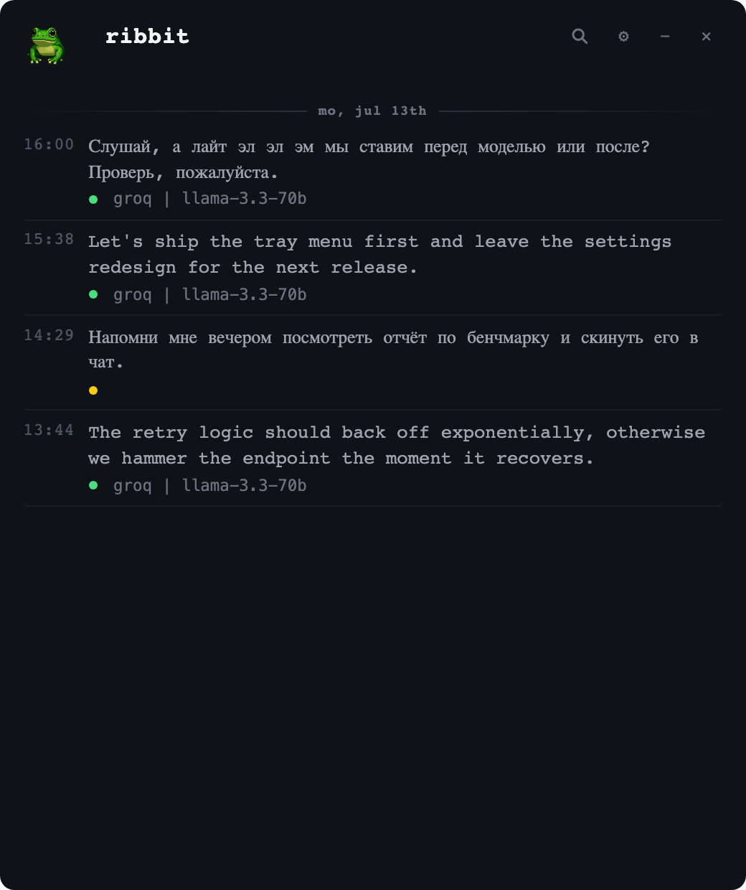
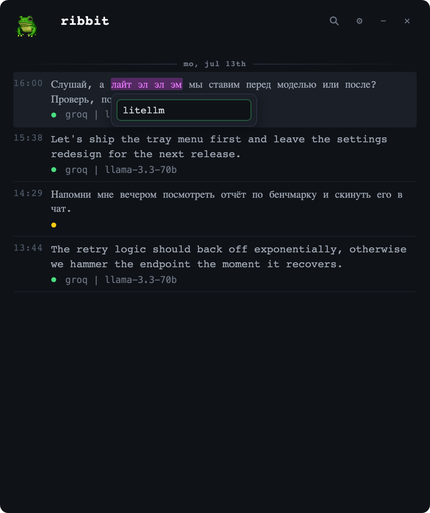
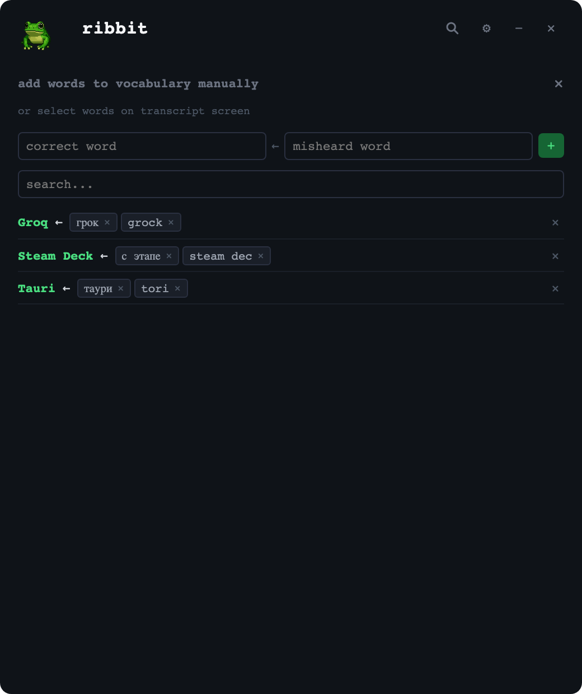
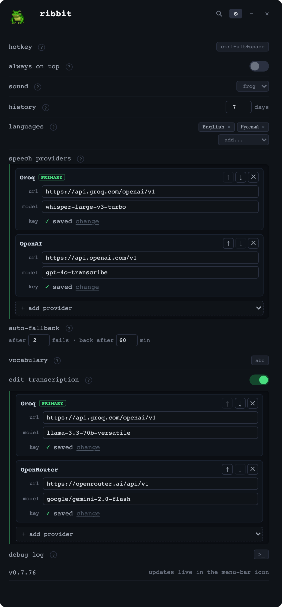

  

<h1 align="center">Ribbit</h1>

  Voice to text, anywhere on your desktop. 
  Hold a hotkey, speak, let go — the text lands in the window you were already typing in.

  <b>Free</b> — runs on a free <a href="https://console.groq.com/keys">Groq</a> key, no card 
  <b>Yours</b> — the log lives on your disk, no cloud, no telemetry

## Get it

  &nbsp;
  &nbsp;
  

Each button downloads the latest installer for that platform. Want an older build? Every version is on the [releases page](https://github.com/olegperegudov/ribbit/releases).

Then:

1. **Open it.** Apple isn't paid to trust us, so the first launch claims the app is *"damaged"*. It isn't — run `xattr -cr /Applications/Ribbit.app` once in Terminal, then open it normally. Updates after that install themselves.
2. **Paste a key.** Ribbit asks for one on the first launch: [console.groq.com](https://console.groq.com/keys) → *API Keys* → *Create API Key* → copy the `gsk_…` string. Free, no card.
3. **Hold ⌃⌥Space, speak, let go.** The text is typed into whatever window you were in. On Windows: `Ctrl+Alt+Space`.

Ribbit is built and used on macOS. The Windows build exists and installs, but it isn't tested nearly as much — expect rough edges.

## Everything you said, kept

Every dictation lands in a log, grouped by day. Click a line — it's on your clipboard.

## A word it keeps mishearing — fix it once

Transcription mangles names and jargon. Select the mangled word right there in the log and type what it should have been. From then on Ribbit swaps it silently, every time.

The whole list lives under the gear — add, search, remove.

## Never wait on one provider

Add as many as you like: the top one does the work, the rest wait for the day it doesn't. After enough failures in a row — rate limit, outage, timeout — Ribbit drops to the next one, then climbs back to the top once the cooldown passes. Both numbers are yours. The model that polishes the text afterwards has the same stack.

## Updates

The frog in the menu bar turns green when a new version is out. Click it, pick the update line — done.

## Privacy

- Audio goes to the provider you picked, for transcription, and nowhere else.
- Key, log and vocabulary stay in a folder on your machine.
- No analytics, no tracking, no other network calls.

## Under the hood

Stack, local build, tests, signing and the release pipeline → [docs/DEVELOPMENT.md](docs/DEVELOPMENT.md).

## License

MIT
